<!-- banner -->
<p align="center">
  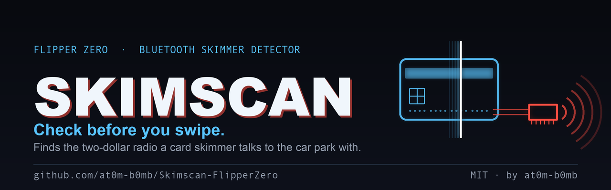
</p>

<h1 align="center">Skimscan 💳</h1>
<p align="center"><i>Check before you swipe.</i></p>

<p align="center">
  
  
  
  
  
  
</p>

<p align="center">
  A card skimmer fitted to a fuel pump is usually built around a <b>two-dollar Bluetooth serial
  bridge</b> — an HC-05 or one of its clones — spliced across the card reader's data lines and
  powered from the pump. Nobody comes back for the card numbers. They are collected over the air,
  from a car in the lot. <b>That radio is the one part of a skimmer you can find from the outside</b>,
  and Skimscan is what looks for it.
</p>

<p align="center"><sub>It will never tell you a pump is safe. It will tell you exactly what it heard, and exactly why it scored it.</sub></p>

---

## 📟 On the Flipper

<p align="center">
  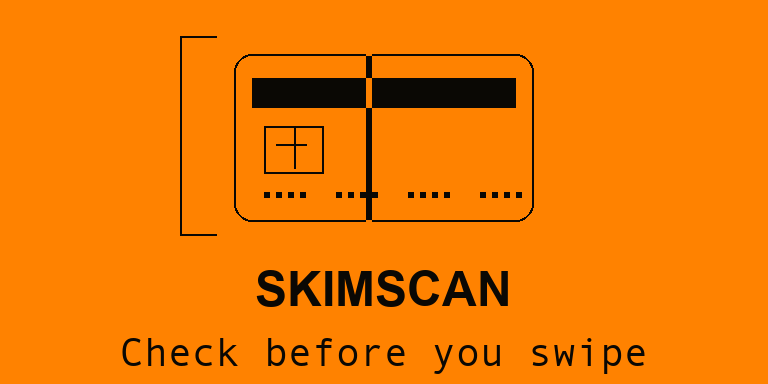
</p>
<p align="center">
  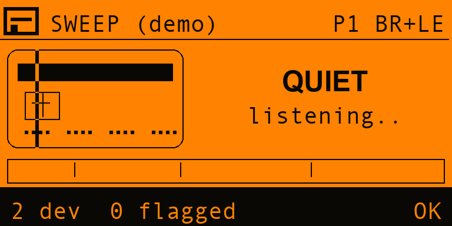
  &nbsp;
  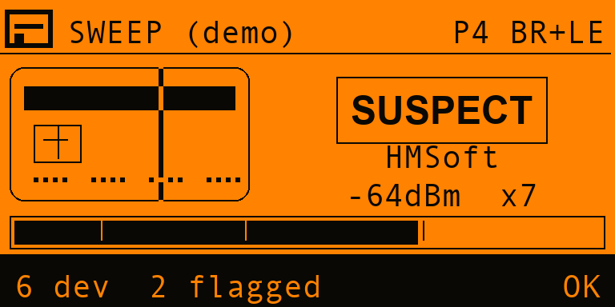
  &nbsp;
  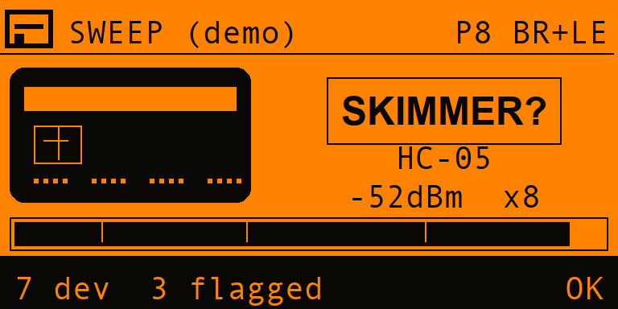
</p>
<p align="center">
  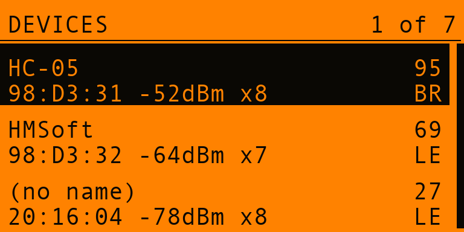
  &nbsp;
  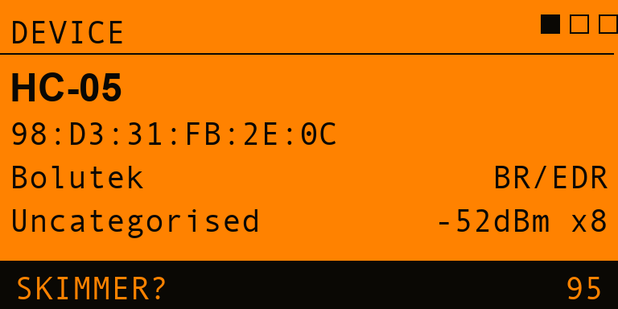
  &nbsp;
  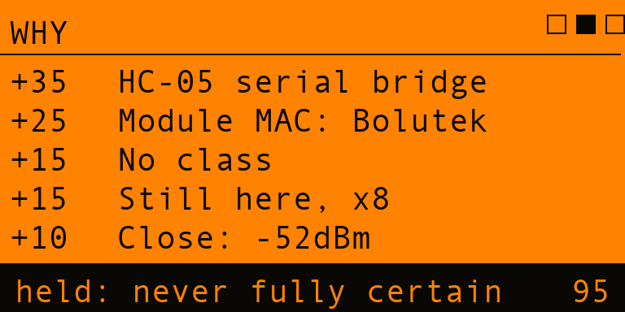
</p>
<p align="center">
  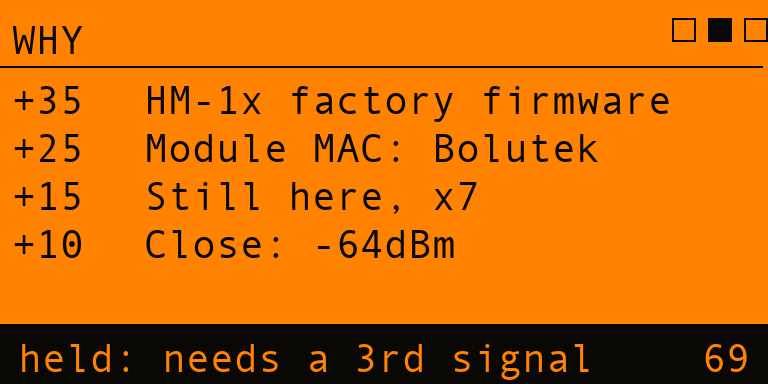
  &nbsp;
  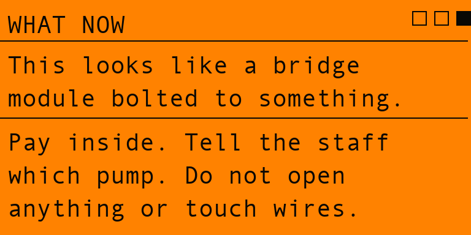
  &nbsp;
  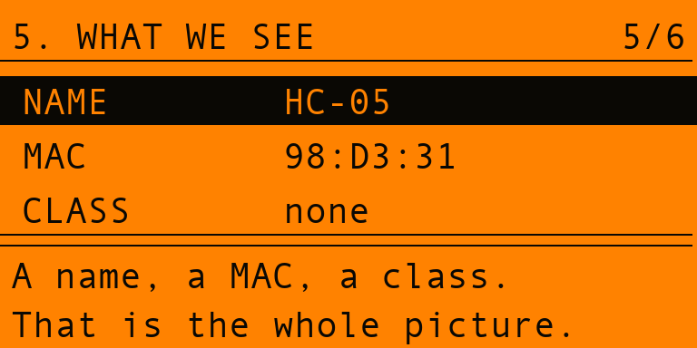
</p>
<p align="center">
  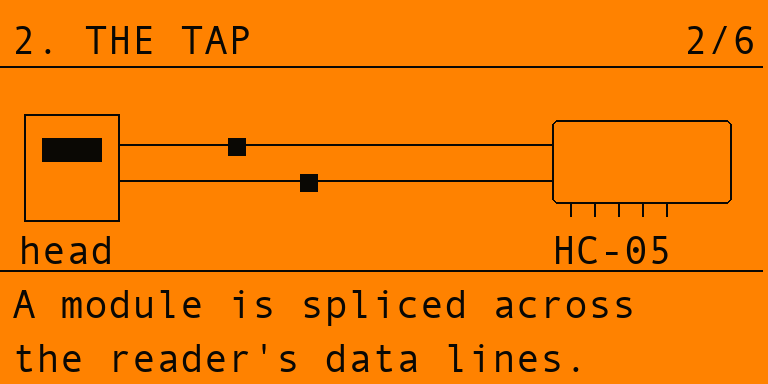
  &nbsp;
  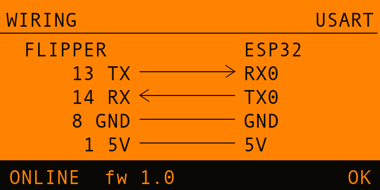
  &nbsp;
  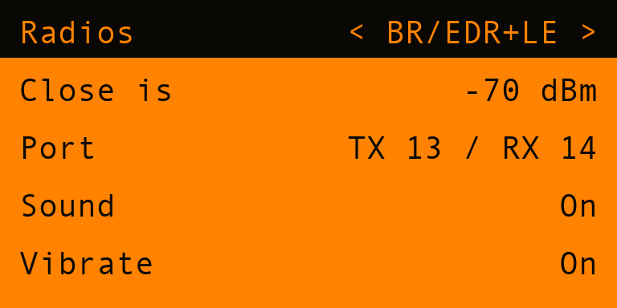
</p>
<p align="center">
  <sub><b>Sweep</b> — listening &nbsp;·&nbsp; a <b>SUSPECT</b> &nbsp;·&nbsp; and the thing itself
  &nbsp;·&nbsp; <b>Devices</b>, worst first &nbsp;·&nbsp; <b>the facts</b> &nbsp;·&nbsp;
  <b>the working</b> &nbsp;·&nbsp; <b>a score held down</b>, and why &nbsp;·&nbsp; <b>what to do</b>
  &nbsp;·&nbsp; <b>how the attack works</b> &nbsp;·&nbsp; <b>the tap</b> &nbsp;·&nbsp;
  <b>wiring</b> with a live link check &nbsp;·&nbsp; <b>settings</b></sub>
</p>

> Every number in those screenshots came out of the real scoring engine.
> `make -C test dump` runs the scripted forecourt through `skim_score()` and writes the JSON that
> `tools_gen_mockups.py` draws from, so the README cannot drift away from what the app does.

---

## ✨ Features

- 🔍 **It looks for the radio, not the skimmer.** BR/EDR general inquiry plus LE scanning, through
  an ESP32 companion, because the Flipper's own Bluetooth stack can advertise but cannot inquire and
  has no BR/EDR at all.
- 🧮 **Seven signals, three independent families.** What it calls itself (*identity*), what kind of
  device it claims to be (*declaration*), and how it behaves over time (*behaviour*). A score is
  only allowed to climb as far as the **breadth** of the evidence justifies.
- 🧾 **Every score shows its working.** Open any device and the **WHY** page lists each signal that
  fired, what it was worth, and — the important part — **which cap held the score down**.
- 🚫 **It never says a pump is safe.** The best a sweep can say is `NO MATCH`: nothing here looked
  like a skimmer radio. Most skimmers are not radios at all.
- ⏱️ **A fixture has to prove it is a fixture.** Pass counting is what separates a module bolted
  into a pump from a passer-by's phone — and nothing reaches the top band on a single sighting.
- 📚 **A six-panel walkthrough of the attack**, drawn and animated on the device: where the module
  goes, why it is a radio, why nobody comes back for it, and exactly how little an inquiry response
  tells you.
- 🔌 **Wiring diagram on the device**, with a live *is-it-actually-talking* status strip.
- 🧪 **Demo mode.** A scripted forecourt — a few phones, a speaker, a beacon, a customer who drives
  off after two passes, and one HC-05 that is still there every time you look. No hardware needed.
- 🧷 **CSV sweep logs** to the SD card: address, score, verdict and the signals behind it — the form
  a station manager or a police report can actually use.
- 🔕 **Three levels of alarm** you can tell apart with the Flipper in a pocket, all optional.
- 🕶️ **Listen-only.** Skimscan never pairs, never connects, and is not itself discoverable.

---

## 🧠 How it scores

### The seven signals

| Signal | Family | Worth | What it means |
|---|---|---:|---|
| Known module name | identity | 35 | The factory name of a serial bridge — `HC-05`, `linvor`, `HMSoft`, `RNBT-…`. Renaming it is one AT command, so it is a hint, not a finding. |
| Module maker's MAC | identity | 25 | The first three bytes belong to a firm that makes serial-bridge modules and little else. Independent of the name. |
| Odd MAC prefix | identity | 12 | A MAC shaped like a date (`20:16:…`), or one the device chose for itself. Clone firmware does this; finished products do not. |
| Declares no class | declaration | 15 | Real products say what they are. This left the Class-of-Device field blank, which is the module default. |
| Findable but nameless | declaration | 6 | Made itself discoverable on BR/EDR, then declined to say what it is. |
| Still here, pass after pass | behaviour | 15 | Three inquiry passes. People walk away; something wired into a pump does not. |
| Close enough to be here | behaviour | 10 | Loud enough to be inside this pump rather than in a car across the forecourt. |

`35 + 25 + 15 + 15 + 10 = 100` is the only route to a full score — and the caps still take five off it.

### The caps are the design

Without them the engine is a keyword search that shouts SKIMMER at anyone's robot kit, and **one bad
call in a petrol station forecourt is worse than ten quiet ones**.

| Cap | Held at | Why |
|---|---:|---|
| Behaviour only | `14` | The speaker in the shop is close by and never moves. If that were worth reporting, everything would be. |
| No identity signal | `39` | Nothing about it says *bridge module*. |
| One family of evidence | `39` | Two identity signals are one opinion told twice. |
| Fewer than three families | `69` | The top band needs three independent kinds of evidence. |
| Seen once | `69` | A single sighting cannot tell a fixture from someone walking past. |
| Anything at all | `95` | No scan is ever certain from outside a locked panel. |

### The bands

| Score | Verdict | Meaning |
|---:|---|---|
| 0–14 | `ORDINARY` | Looks like ordinary consumer Bluetooth. |
| 15–39 | `NOTE` | One thing stood out. Probably nothing. |
| 40–69 | `SUSPECT` | Several signals line up. Worth a second sweep. |
| 70–95 | `SKIMMER?` | This looks like a bridge module bolted to something. |

A sweep's headline is its worst device — and a sweep that found nothing says **`NO MATCH`**, never
*clear* and never *safe*.

---

## 🔌 Hardware

The Flipper's Bluetooth stack advertises; it cannot run an inquiry, and it has **no BR/EDR radio at
all**. Skimmer modules live on BR/EDR. So the radio is an ESP32 on the GPIO header.

> **It must be a classic ESP32** (ESP32-WROOM-32 or similar). The **S2, S3 and C3 have no Bluetooth
> Classic** and cannot do this. The official Flipper WiFi devboard is an S2 — it will not work.

| Flipper | | ESP32 |
|---|:-:|---|
| `13` TX | → | `RX0` |
| `14` RX | ← | `TX0` |
| `8` GND | — | `GND` |
| `1` 5V | — | `5V` / `VIN` |

115200 8N1. The companion uses its own UART0, which is also its USB programming port, so the board
talks to your computer **or** to the Flipper — never both at once.

Boards that also carry GPS can be moved to the LPUART (`15`/`16`) in **Settings → Port**, leaving
13/14 free.

**Flashing:** open `esp32/skimscan_esp32/skimscan_esp32.ino` in the Arduino IDE with the
[ESP32 board package](https://github.com/espressif/arduino-esp32) installed, pick a plain **ESP32
Dev Module**, and upload. No libraries to add — it uses the ESP-IDF Bluetooth APIs the core already
ships.

---

## 🎮 Controls

| Screen | Key | Does |
|---|---|---|
| **Sweep** | `OK` | Open the device list |
| | `OK` (hold) | Throw the sweep away and start again |
| **Devices** | `↑` `↓` | Pick a device |
| | `OK` | Open it |
| **Device** | `←` `→` | `DEVICE` · `WHY` · `WHAT NOW` |
| **How skimmers work** | `←` `→` | Walk the six panels |

---

## 🚀 Install

**From the release** — grab `skimscan.fap` from
[Releases](https://github.com/at0m-b0mb/Skimscan-FlipperZero/releases) and drop it in
`SD Card/apps/Bluetooth/`. It appears under **Apps → Bluetooth → Skimscan**.

**From source** — needs [`ufbt`](https://github.com/flipperdevices/flipperzero-ufbt):

```bash
python3 -m pip install --upgrade ufbt && ufbt update --channel=release && ufbt
```

Then `ufbt launch` with the Flipper plugged in, or copy `dist/skimscan.fap` across yourself.

**No ESP32 to hand?** Turn on **Settings → Demo mode** and sweep. The scripted forecourt runs off
the tick and every screen works.

---

## 🧪 Tests

The engine *is* the product — everything on screen is a rendering of what `skim_score()` decided,
and no screenshot can vouch for any of it. So every table entry, boundary, cap and invariant is
checked on the host on every push:

```bash
make -C test
```

> `329673 checks, 0 failures`

That number is mostly one thing: an **exhaustive sweep of the whole evidence space** — every
combination of address, name, class, radio, level, pass count and threshold — asserting the claims
the caps exist to make. Among them:

- a score may never exceed its raw total, and a capped score must always say why;
- `SKIMMER?` requires three families, an identity signal, **and** a second sighting;
- `NOTE` requires more than sitting still;
- LE is never penalised for behaving like LE (random addresses and nameless beacons are normal there);
- and the wording rules — no headline may claim safety, no cap reason may be too long to print, no
  line of explanation may be too wide for a 128-pixel screen.

There is also a false-positive suite: every factory name in the table must match itself, and a car
park's worth of ordinary Bluetooth (`iPhone`, `JBL Flip 5`, `Ford SYNC`, `ELM327`, `AirPods Pro`, …)
must match nothing.

---

## ⚠️ Honest limits

- **Most skimmers are not radios.** They store to flash, or use GSM, or are a pinhole camera over
  the PIN pad. **None of those are visible to this.** A quiet sweep is not a clean pump.
- **A renamed module defeats the name table.** It is one AT command. That is why a name alone is
  capped well below a verdict.
- **A hobbyist's HC-05 will score.** So will a robot kit in a rucksack, until it leaves. The pass
  counter is what sorts that out, and it needs you to sweep for more than a few seconds.
- **RSSI is not distance.** "Close" is a rough proxy for "inside this pump", and metal panels make
  it a poor one.
- **The MAC tables are not exhaustive** and never can be. They cover the module makers that turn up
  in practice.
- **This is a screening aid, not evidence.** It tells you what it heard and why it scored it. The
  judgement is yours.
- **Do not open a pump, pull at a reader, or touch wiring.** If a pump scores, pay inside, tell the
  staff which pump it was, and report it.

---

## 📁 Layout

```
skimscan.c / skimscan_i.h    app shell, alarm ladders
helpers/skim_sigs.{c,h}      signature tables: names, OUIs, class of device  ← pure, host-tested
helpers/skim_score.{c,h}     the scoring engine and its caps                 ← pure, host-tested
helpers/skim_db.{c,h}        device table, pass counting, worst-first order
helpers/skim_link.{c,h}      UART worker and line protocol to the companion
helpers/skim_store.{c,h}     settings persistence + CSV sweep log
helpers/skim_demo.{c,h}      the scripted forecourt
views/                       sweep, list, detail (3 pages), learn (6 panels), wiring, splash, card art
scenes/                      start, sweep, list, detail, learn, wiring, settings, about
esp32/skimscan_esp32/        the companion firmware (Arduino / ESP-IDF APIs)
test/                        host tests for the engine, and the demo dump the mockups draw from
tools_gen_*.py               icons, banner and mock screenshots (Pillow)
```

---

## 📜 Licence

MIT — see [LICENSE](LICENSE).

Built by [**at0m-b0mb**](https://github.com/at0m-b0mb). Part of a family of Flipper Zero
counter-surveillance tools: [Nyx](https://github.com/at0m-b0mb/Nyx-FlipperZero) finds hidden cameras
by the infrared they emit, [Vulpes](https://github.com/at0m-b0mb/Vulpes-FlipperZero) finds hidden
transmitters by the RF they emit, and **Skimscan** finds the radio a card skimmer gives itself away
with.

<p align="center"><sub>Sweep pumps you are about to use, or where you have permission. Report what
you find — do not touch it.</sub></p>
